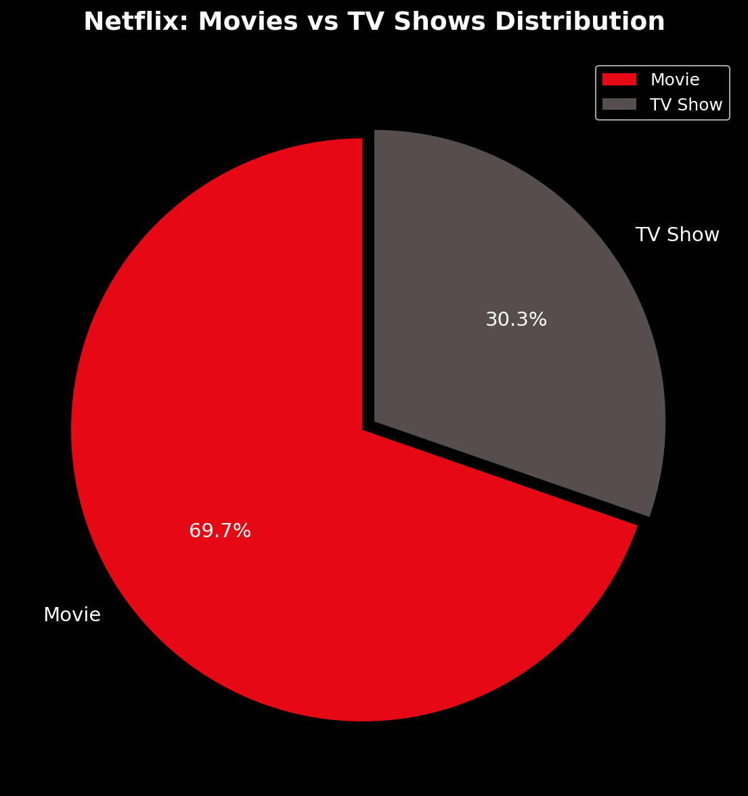
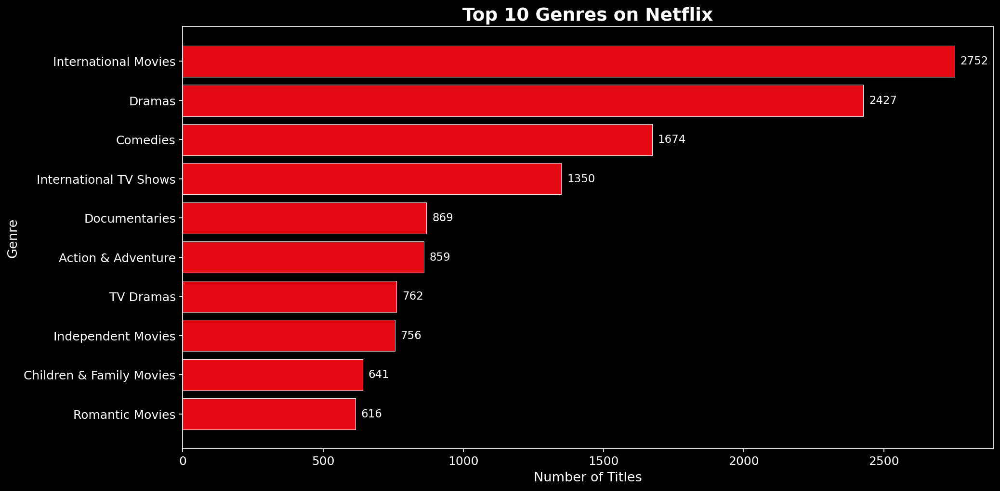
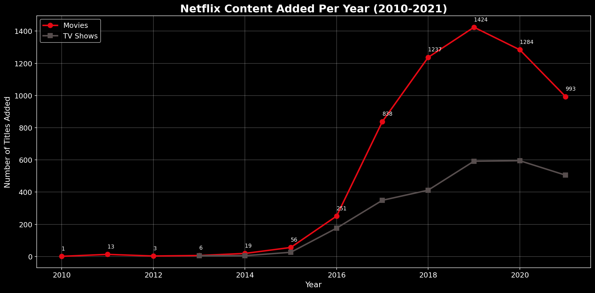
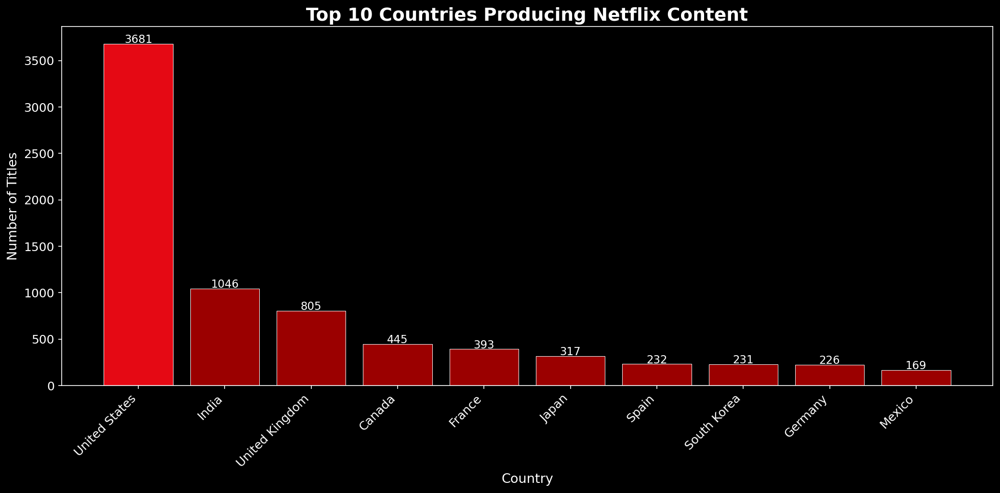
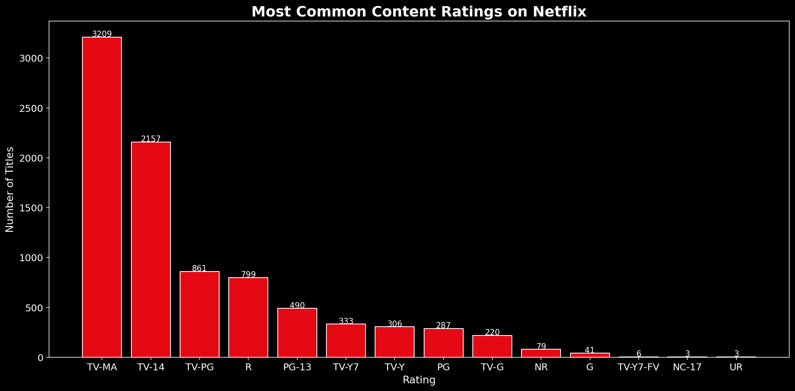
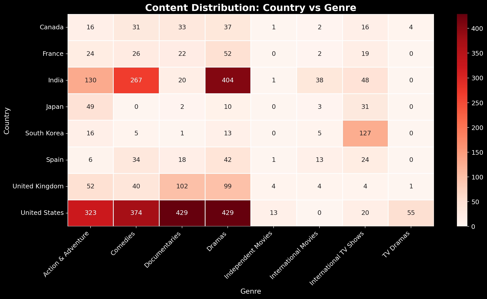

# 🎬 Netflix Content Analysis

## 📌 Problem Statement
Analyze Netflix content library to identify 
content trends, popular genres, and growth 
patterns to understand Netflix's content strategy.

---

## 🛠️ Tools Used
- Python
- Pandas
- NumPy
- Matplotlib
- Seaborn
- Jupyter Notebook

---

## 📂 Dataset
- Source: Kaggle — Netflix Movies and TV Shows
- Link: kaggle.com/datasets/shivamb/netflix-shows
- Size: 8,807 titles
- Columns: 12

---

## 📊 Project Structure
Netflix-Content-Analysis/
├── netflix_analysis.ipynb
├── netflix_titles.csv
├── netflix_cleaned.csv
├── README.md
├── visuals/
│ ├── movies_vs_tvshows.png
│ ├── top_genres.png
│ ├── content_per_year.png
│ ├── top_countries.png
│ ├── ratings.png
│ └── heatmap_country_genre.png

---

## 🔍 Analysis Performed
- Movies vs TV Shows Distribution
- Top 10 Genres on Netflix
- Content Added Per Year Trend
- Top Countries Producing Content
- Most Common Content Ratings
- Country vs Genre Heatmap

---

## 📈 Visualizations

### Movies vs TV Shows

### Top 10 Genres

### Content Added Per Year

### Top Countries

### Ratings Distribution

### Country vs Genre Heatmap

---

## 💡 Key Insights
1. Netflix library is 70% Movies and 30% TV Shows
2. Content addition grew rapidly after 2016
3. USA produces the highest content on Netflix
4. International Movies and Dramas are top genres
5. TV-MA is the most common rating — adult focused platform
6. India is the 2nd largest content producing country
7. Content addition peaks in Q4 (Oct-Dec)

---

## ✅ Business Recommendations
1. Invest more in TV Show production for higher engagement
2. Expand content in South Korea, Nigeria, Brazil markets
3. Create more Family and Kids content to fill gap
4. Schedule major launches in Q4 for subscriber retention
5. Focus on Documentary genre for loyal audience growth

---

## 👤 Author
- Name: Anupam Verma
- LinkedIn: linkedin.com/in/anupamverma97705371/
- Email: anupamverma9753@gmail.com
